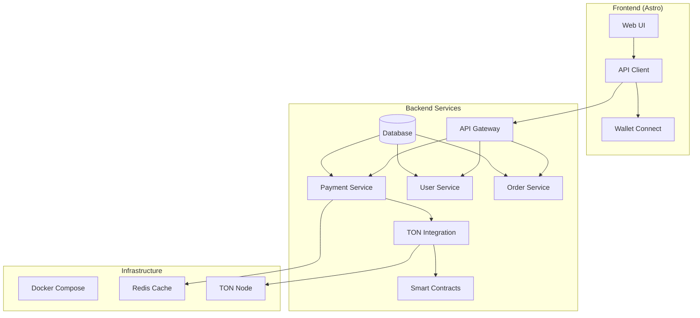

# krypton
Krypton payment system

Пока краткое описание от claude архитектуры https://claude.ai/chat/fc4a800d-5685-43b0-96a0-3a09fcaafd12



# Давайте разберем каждый компонент:

1. Frontend (Astro):
   - Single Page Application с SSR для лучшей производительности
   - Интеграция с TON Connect для работы с кошельками
   - Компоненты для отображения цен, истории транзакций и баланса
   - Интерактивная форма покупки Stars

2. Backend (Rust):
   - API Gateway для маршрутизации запросов
   - Микросервисная архитектура:
     - Payment Service: обработка платежей и интеграция с TON
     - User Service: управление пользователями и их балансами
     - Order Service: управление заказами и транзакциями
   - Интеграция с TON через ton-client-rs

3. Blockchain (TON):
   - Smart-контракты на FunC для обработки платежей
   - Интеграция с TON Payments для безопасных транзакций
   - Взаимодействие с Telegram API для активации Stars

4. Инфраструктура:
   - Docker контейнеры для каждого сервиса
   - Docker Compose для оркестрации
   - Redis для кэширования и очередей
   - PostgreSQL для хранения данных
   - TON Node для взаимодействия с блокчейном

Docker-compose структура могла бы выглядеть так:

```yaml
services:
  frontend:
    build: ./frontend
    ports:
      - "3000:3000"
    depends_on:
      - api-gateway

  api-gateway:
    build: ./api-gateway
    ports:
      - "8080:8080"
    depends_on:
      - payment-service
      - user-service
      - order-service

  payment-service:
    build: ./payment-service
    depends_on:
      - postgres
      - redis
      - ton-node

  user-service:
    build: ./user-service
    depends_on:
      - postgres

  order-service:
    build: ./order-service
    depends_on:
      - postgres

  postgres:
    image: postgres:latest
    volumes:
      - postgres-data:/var/lib/postgresql/data

  redis:
    image: redis:latest
    volumes:
      - redis-data:/data

  ton-node:
    image: ton-node:latest
    volumes:
      - ton-data:/var/ton-work
```

# Для начала разработки я бы рекомендовал следующие шаги:

1. Создать базовый прототип на Astro с моковыми данными
2. Разработать основные смарт-контракты
3. Реализовать базовые микросервисы на Rust
4. Настроить Docker-инфраструктуру
5. Интегрировать TON Connect
6. Добавить мониторинг и логирование

# Варианты названий

В таком случае давайте подумаем о более универсальном названии для платежной/монетизационной системы. Для крипто-платформы название должно звучать современно, технологично и вызывать доверие:

1. Финансовые/Платежные ассоциации:
- Paynexus
- Payverse
- Flowpay

2. Космические/Футуристичные:
- Nebula Pay
- Nova Finance
- Stellar Pay

3. Современные односложные:
- Float
- Flux
- Surge
- Prism
- Nexus
- Wave

4. Абстрактные/Креативные:
- Zinc (как элемент - базовый, надёжный)
- Krypton (отсылка к криптографии)
- Quark (маленький, но фундаментальный)

Из всех вариантов я бы особенно выделил "Flux":
- Короткое и мощное
- Означает постоянное движение/поток (как денежный поток)
- Технологично звучит
- Легко запоминается
- Намекает на гибкость системы
- Хорошо работает для международной аудитории
- Подходит для любых типов криптовалют
- Отлично подойдет для брендинга
- Доменное имя может быть flux.finance или getflux.com

Второй сильный вариант - "Nexus":
- Означает связь/соединение (что отражает суть платформы)
- Звучит серьезно и профессионально
- Технологичное название
- Подразумевает центральную точку соединения разных систем
- Масштабируемое для будущих функций
- Легко произносится на разных языках
