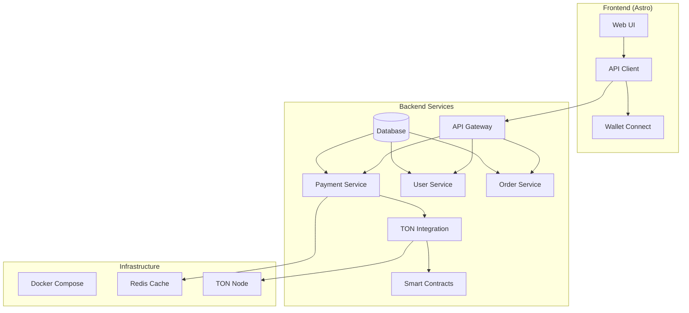
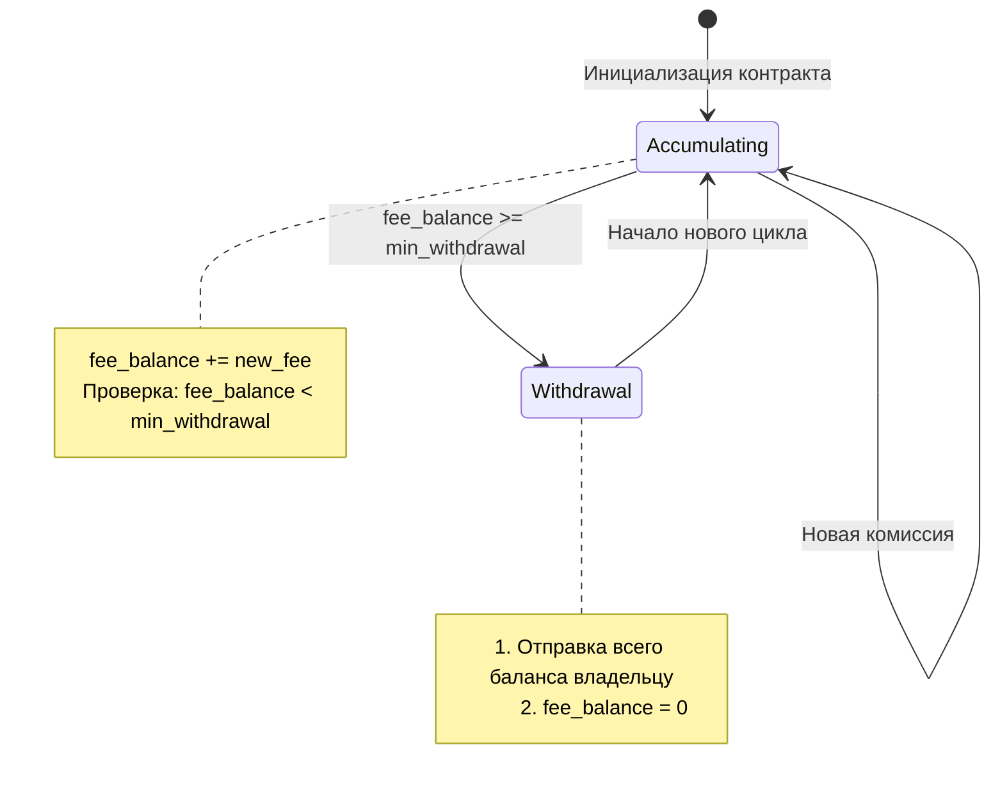
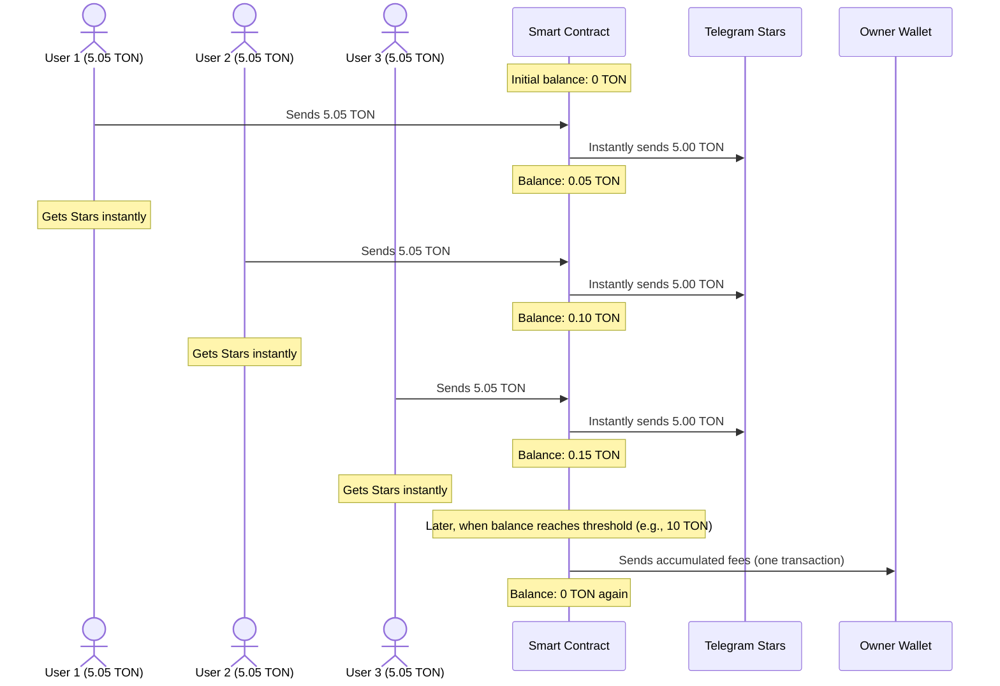

# krypton
Krypton payment system - бета версия название проекта, может измениться в будущем
Архитектура тоже пока просто наброски, изменится в будущем.

Пока краткое описание от claude архитектуры https://claude.ai/chat/fc4a800d-5685-43b0-96a0-3a09fcaafd12



# Давайте разберем каждый компонент:

1. Frontend (Astro):
   - Single Page Application с SSR для лучшей производительности
   - Интеграция с TON Connect для работы с кошельками
   - Компоненты для отображения цен, истории транзакций и баланса
   - Интерактивная форма покупки Stars

2. Backend (Rust):
   - API Gateway для маршрутизации запросов
   - Микросервисная архитектура:
     - Payment Service: обработка платежей и интеграция с TON
     - User Service: управление пользователями и их балансами
     - Order Service: управление заказами и транзакциями
   - Интеграция с TON через ton-client-rs

3. Blockchain (TON):
   - Smart-контракты на FunC для обработки платежей
   - Интеграция с TON Payments для безопасных транзакций
   - Взаимодействие с Telegram API для активации Stars

4. Инфраструктура:
   - Docker контейнеры для каждого сервиса
   - Docker Compose для оркестрации
   - Redis для кэширования и очередей
   - PostgreSQL для хранения данных
   - TON Node для взаимодействия с блокчейном

Docker-compose структура могла бы выглядеть так:

```yaml
services:
  frontend:
    build: ./frontend
    ports:
      - "3000:3000"
    depends_on:
      - api-gateway

  api-gateway:
    build: ./api-gateway
    ports:
      - "8080:8080"
    depends_on:
      - payment-service
      - user-service
      - order-service

  payment-service:
    build: ./payment-service
    depends_on:
      - postgres
      - redis
      - ton-node

  user-service:
    build: ./user-service
    depends_on:
      - postgres

  order-service:
    build: ./order-service
    depends_on:
      - postgres

  postgres:
    image: postgres:latest
    volumes:
      - postgres-data:/var/lib/postgresql/data

  redis:
    image: redis:latest
    volumes:
      - redis-data:/data

  ton-node:
    image: ton-node:latest
    volumes:
      - ton-data:/var/ton-work
```

# Для начала разработки я бы рекомендовал следующие шаги:

0. Найти базовый дизайн, украсть, купить, получить any price.
1. Создать базовый прототип на Astro с моковыми данными
2. Разработать основные смарт-контракты
3. Реализовать базовые микросервисы на Rust
4. Настроить Docker-инфраструктуру
5. Интегрировать TON Connect
6. Добавить мониторинг и логирование

# Варианты названий

В таком случае давайте подумаем о более универсальном названии для платежной/монетизационной системы. Для крипто-платформы название должно звучать современно, технологично и вызывать доверие:

1. Финансовые/Платежные ассоциации:
- Paynexus
- Payverse
- Flowpay

2. Космические/Футуристичные:
- Nebula Pay
- Nova Finance
- Stellar Pay

3. Современные односложные:
- Float
- Flux
- Surge
- Prism
- Nexus
- Wave

4. Абстрактные/Креативные:
- Zinc (как элемент - базовый, надёжный)
- Krypton (отсылка к криптографии)
- Quark (маленький, но фундаментальный)

Из всех вариантов я бы особенно выделил "Flux":
- Короткое и мощное
- Означает постоянное движение/поток (как денежный поток)
- Технологично звучит
- Легко запоминается
- Намекает на гибкость системы
- Хорошо работает для международной аудитории
- Подходит для любых типов криптовалют
- Отлично подойдет для брендинга
- Доменное имя может быть flux.finance или getflux.com

Второй сильный вариант - "Nexus":
- Означает связь/соединение (что отражает суть платформы)
- Звучит серьезно и профессионально
- Технологичное название
- Подразумевает центральную точку соединения разных систем
- Масштабируемое для будущих функций
- Легко произносится на разных языках


# Примеры дизайна 
- https://themeforest.net/item/gamfi-metaverse-web3-igoido-token-launchpad-figma-template/35809424
- https://themeforest.net/item/coin-desk-crypto-trading-exchange-ui-template-in-figma/36406053
- https://themeforest.net/item/binasea-nft-marketplace-template/39023921
- https://creativemarket.com/rony156953/7191585-Rapy-NFT-Marketplace-Figma-File
- https://www.figma.com/design/FSI1fhl6k1UHHmSMO4KMHP/Cryptocurrency-Landing-Page-%26-Dashboard-(Community)?node-id=2-5804&p=f&t=tqU0ZYIdbZqNgQ5M-0

# Варианты получения комиссии

А, верно подмечено! Действительно, отправка комиссии отдельной транзакцией будет затратной. Есть несколько способов оптимизации:

1. Накопительный способ (рекомендую):
```rust
struct FeeCollector {
    fee_balance: u64,          // Накопленные комиссии
    min_withdrawal: u64,       // Минимальная сумма для вывода
    owner_address: Address,    // Ваш адрес
}

impl FeeCollector {
    fn add_fee(&mut self, amount: u64) {
        self.fee_balance += amount;
        
        // Если накопилось достаточно - отправляем одной транзакцией
        if self.fee_balance >= self.min_withdrawal {
            send_tons(self.owner_address, self.fee_balance);
            self.fee_balance = 0;
        }
    }
}
```

2. Или можно использовать MultiSend для батчинга транзакций:
```rust
struct BatchProcessor {
    pending_fees: Vec<(Address, u64)>,
    batch_size: usize,
}

impl BatchProcessor {
    fn add_fee(&mut self, address: Address, amount: u64) {
        self.pending_fees.push((address, amount));
        
        if self.pending_fees.len() >= self.batch_size {
            self.process_batch();
        }
    }

    fn process_batch(&mut self) {
        // Отправляем все накопленные комиссии одной транзакцией
        let mut message = ton_types::MessageBuilder::new();
        for (addr, amount) in self.pending_fees.iter() {
            message.add_destination(addr, amount);
        }
        
        send_multi(message);
        self.pending_fees.clear();
    }
}
```

3. Или можно реализовать систему клейм (claim), где вы сами забираете комиссии когда удобно:
```rust
struct ClaimableFees {
    fees: HashMap<Address, u64>,  // Баланс по адресам
    owner: Address,
}

impl ClaimableFees {
    fn add_fee(&mut self, amount: u64) {
        // Просто записываем в баланс
        *self.fees.entry(self.owner).or_default() += amount;
    }

    fn claim(&mut self) {
        require(msg.sender == self.owner, "Not authorized");
        
        if let Some(amount) = self.fees.get(&self.owner) {
            send_tons(self.owner, *amount);
            self.fees.remove(&self.owner);
        }
    }
}
```

Я бы рекомендовал первый вариант (накопительный), потому что:
- Автоматический - не требует ручных действий
- Экономит на комиссиях за счет батчинга
- Простой в реализации и поддержке
- Можно настроить порог вывода в зависимости от текущих цен на газ

# Первый вариант подробнее

Давайте разберу подробно накопительный механизм сбора комиссий:




Вот полная реализация:

```rust
struct FeeCollector {
    fee_balance: u64,          // Текущий баланс накопленных комиссий
    min_withdrawal: u64,       // Минимальная сумма для автоматического вывода (например, 1 TON)
    owner_address: Address,    // Ваш адрес для получения комиссий
    total_collected: u64,      // Общая сумма собранных комиссий (для статистики)
    last_withdrawal_time: u64, // Время последнего вывода
}

impl FeeCollector {
    // Инициализация коллектора
    fn new(owner: Address, min_amount: u64) -> Self {
        Self {
            fee_balance: 0,
            min_withdrawal: min_amount,
            owner_address: owner,
            total_collected: 0,
            last_withdrawal_time: now(),
        }
    }

    // Добавление новой комиссии
    fn add_fee(&mut self, amount: u64) -> Result<()> {
        // Увеличиваем баланс накопленных комиссий
        self.fee_balance += amount;
        
        // Увеличиваем общий счетчик собранных комиссий
        self.total_collected += amount;
        
        // Проверяем, достигли ли мы минимальной суммы для вывода
        if self.fee_balance >= self.min_withdrawal {
            self.withdraw()?;
        }
        
        Ok(())
    }

    // Вывод накопленных комиссий
    fn withdraw(&mut self) -> Result<()> {
        require(self.fee_balance > 0, "Nothing to withdraw");
        
        // Сохраняем сумму для вывода
        let amount_to_withdraw = self.fee_balance;
        
        // Обнуляем баланс перед отправкой
        self.fee_balance = 0;
        
        // Отправляем все накопленные комиссии одной транзакцией
        send_tons(self.owner_address, amount_to_withdraw)?;
        
        // Обновляем время последнего вывода
        self.last_withdrawal_time = now();
        
        Ok(())
    }

    // Принудительный вывод (если нужно забрать комиссии до достижения min_withdrawal)
    fn force_withdraw(&mut self) -> Result<()> {
        require(msg.sender == self.owner_address, "Only owner can force withdraw");
        self.withdraw()
    }

    // Изменение минимальной суммы для вывода
    fn set_min_withdrawal(&mut self, new_amount: u64) -> Result<()> {
        require(msg.sender == self.owner_address, "Only owner can change settings");
        self.min_withdrawal = new_amount;
        Ok(())
    }

    // Получение статистики
    fn get_stats(&self) -> FeeStats {
        FeeStats {
            current_balance: self.fee_balance,
            total_collected: self.total_collected,
            last_withdrawal: self.last_withdrawal_time,
        }
    }
}
```

Как это работает:

1. При каждой покупке Stars:
   - Пользователь платит $5.05
   - $5 идут на Stars
   - $0.05 добавляются к fee_balance через add_fee()

2. Накопление:
   - Все комиссии накапливаются в fee_balance
   - Никаких промежуточных транзакций не происходит
   - Экономим на газе, так как не отправляем каждую маленькую комиссию

3. Автоматический вывод:
   - Когда fee_balance достигает min_withdrawal
   - Например, установив min_withdrawal = 10 TON
   - Все накопленные комиссии отправляются одной транзакцией
   - После отправки fee_balance обнуляется

4. Дополнительные возможности:
   - force_withdraw() для принудительного вывода
   - Статистика по собранным комиссиям
   - Возможность изменения min_withdrawal

Преимущества такого подхода:
1. Экономия на газе за счет батчинга транзакций
2. Автоматический процесс, не требующий вмешательства
3. Гибкая настройка порога вывода
4. Безопасное хранение комиссий в контракте
5. Прозрачная статистика

# Пояснение по смарт контракту

Нет, вы немного неправильно поняли. Давайте на конкретном примере:

1. Пользователь A платит 5.05$ (комиссия 0.05$)
- В контракте накопилось: 0.05$

2. Пользователь B платит 5.05$ 
- В контракте накопилось: 0.10$

3. Пользователь C платит 5.05$
- В контракте накопилось: 0.15$

И так далее, пока в контракте не накопится например 10 TON комиссий от разных пользователей - только тогда контракт одной транзакцией отправит все накопленные комиссии вам на кошелек.

То есть:
- Пользователи платят свои обычные маленькие суммы
- Контракт накапливает маленькие комиссии от разных пользователей
- Когда накопилась существенная сумма комиссий - отправляет их вам

Это просто механизм оптимизации для вас как владельца сервиса, чтобы не платить комиссию за сеть при каждой маленькой выплате. Пользователи этого даже не замечают - они просто платят свои 5.05$ как обычно.

# Еще пояснение

А, понял вашу озабоченность! Давайте разберу более детально:

В TON (как и в других блокчейнах) смарт-контракт может:
1. Получать средства
2. Хранить их на своем балансе
3. Отправлять их по заданной логике

Вот как это работает пошагово:

```
Пользователь -> (5.05 TON) -> Смарт-контракт:
  - 5.00 TON сразу уходит на Stars
  - 0.05 TON остается на балансе контракта
```

То есть контракт физически хранит эти TON монеты на своем балансе, как мини-кошелек. Когда накопится достаточно (например, 10 TON от разных пользователей) - контракт отправит их на ваш кошелек.

Важно:
- Мы НЕ задерживаем основной платеж пользователя
- Пользователь сразу получает свои Stars
- Только ваша комиссия (0.05) накапливается в контракте

По сути, контракт работает как копилка для ваших комиссий:
1. Пользователь A: +0.05 в копилку
2. Пользователь B: +0.05 в копилку
3. Пользователь C: +0.05 в копилку
...и так далее, пока не наберется сумма для выгодной отправки вам.


# схема движения средств и вывод комиссии



Объяснение схемы:
1. Каждый пользователь отправляет 5.05 TON в смарт-контракт
2. Смарт-контракт МГНОВЕННО отправляет 5.00 TON на Stars
3. 0.05 TON остаются в контракте
4. Пользователь получает Stars сразу
5. Процесс повторяется с каждым пользователем
6. Когда в контракте накопится достаточно TON (например, 10 TON), они одной транзакцией отправляются вам

Ключевые моменты:
- Основная сумма (5.00) не задерживается
- Пользователь получает Stars мгновенно
- Накапливаются только комиссии (0.05)
- Контракт сам следит за балансом и отправляет вам накопленное


